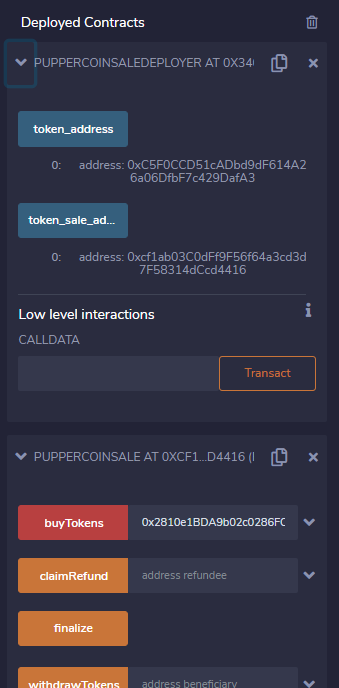
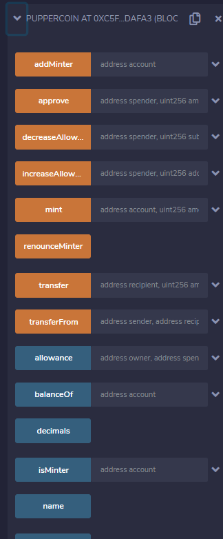
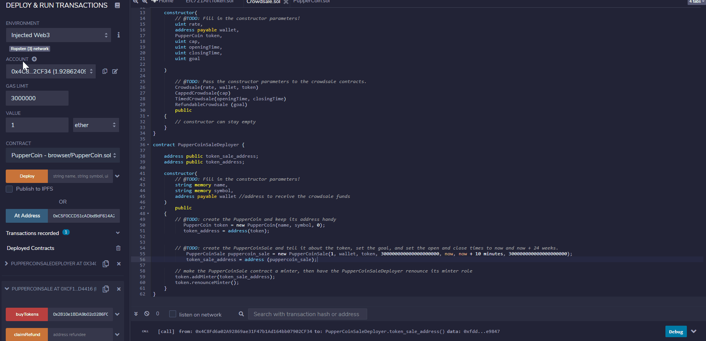
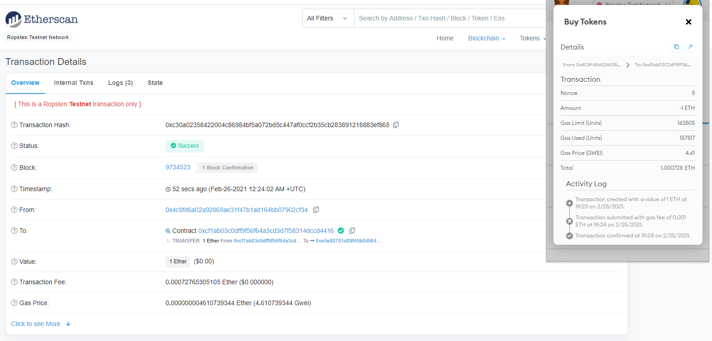
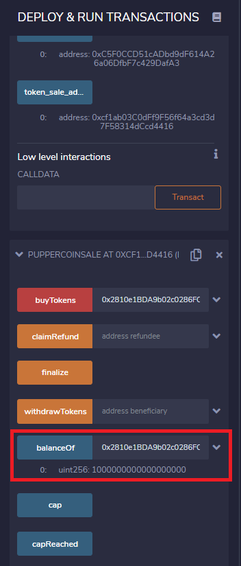
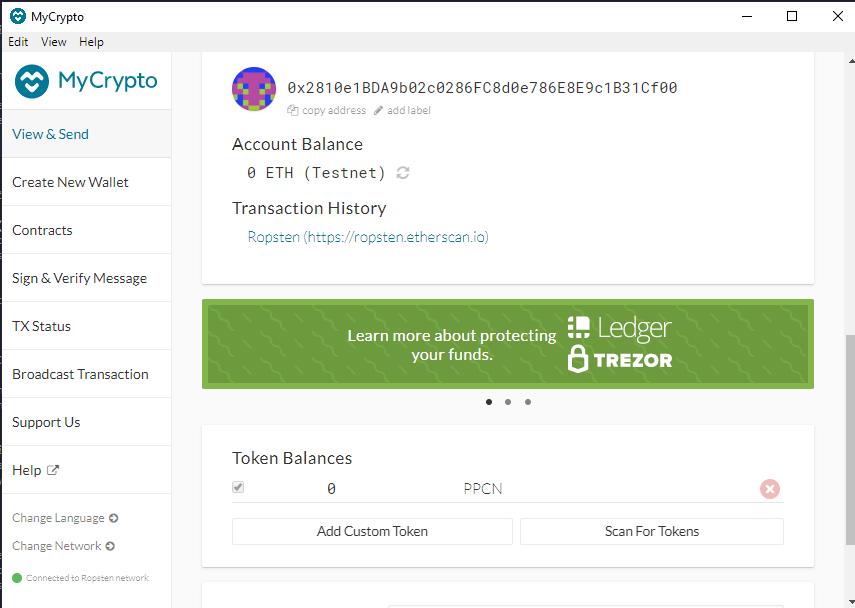
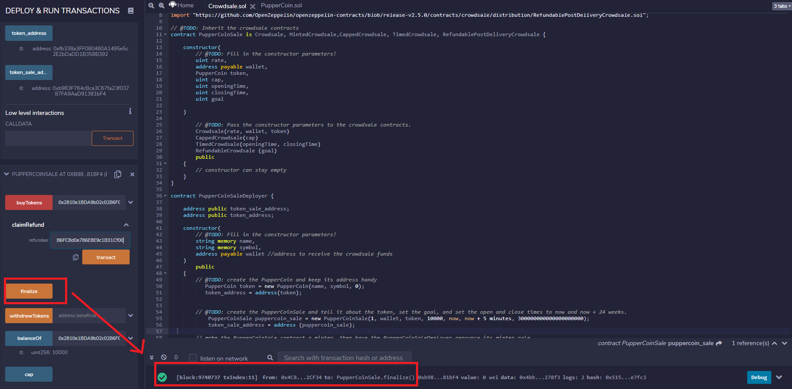
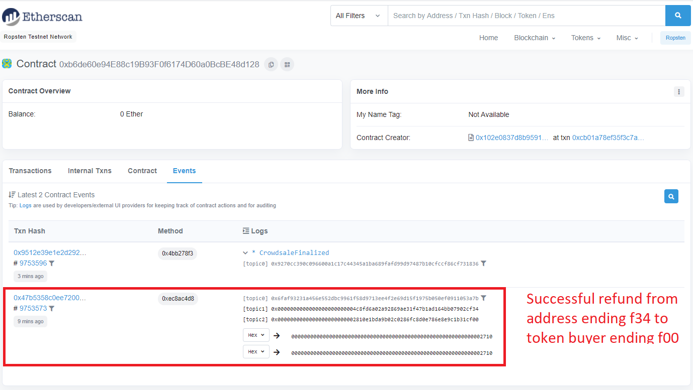

# Crowdsale

In this Unit, we use advanced solidity concepts to create a CrowdSale of a new token called PupperCoin. The raised funds will be used to track dog breeding activity across the globe in a decentralized way. Our goal is to raise 300 ETH from this Crowdsale by minting ERC20 tokens with the help of OpenZeppelin in Solidity.

## Coding the 3 smart contracts

We have compiled and created 3 smart contracts for this crowdsale. Follow the links to see the source code.

1. [PupperCoin](PupperCoin.sol): This contract will be used to create our PupperCoin token. Initial supply is 0, tokens will be minted as funds are raised.

2. [PupperCoinSale](Crowdsale.sol): This contract allows us to buy Tokens, check token balances, finalize the crowdsale and claim refunds amongst other things.

3. [PupperCoinSaleDeployer](Crowdsale.sol): This contract creates two contract addresses: 1 for the token address and another for the token sale address. We can these use these generated contract addresses to deploy the PupperCoin and PupperCoinSale contracts mentioned above. Note that to fill in the cap and goal parameters, I used this [ETH converter](https://eth-converter.com/) to convert 300 ETH to wei. 

------------------------------

## Instructions on Deploying the Contracts

Steps:
1. Compile `PupperCoin.sol` and `Crowdsale.sol` using compiler version 0.5.5

2. Deploy `Crowdsale.sol` by choosing the `PupperCoinSaleDeployer` function from the contract dropdown. Fill in the fields for Name (PupperCoin), Symbol (I chose "PPCN" for this example) and Wallet (Choose your own wallet), then click on transact. This should generate two contract addresses when you click on the button for token address and token_sale_address

3. Go back to the contract deployment section, choose the `PupperCoinSale` function from the dropdown, then copy and paste the "token_sale_address" from the the previous step into the "At Address" field and click on the "At Address" button. This should generate your Puppercoin sale contract below the first contract. 

4. Go back to the contract deployment section, choose the `PupperCoin` function from the dropdown, then copy and paste the "token_address" from the the previous step into the "At Address" field and click on the "At Address" button. This should generate your 3rd and final contract, the PupperCoin contract.

Below are the screenshots of the deployed smart contracts:

Screenshot for PupperCoin contract 

------------------------

## Buying Tokens

In this section, I will show you how to buy tokens with ETH using the contracts we just created. 

- You will need some ETH first since we are doing this in the Ropsten testnet. You can get it from this [Ropsten faucet](https://faucet.ropsten.be/).

- To buy tokens, input the amount of tokens that you want to buy in the "Value" field of Solidity (Note that we have a 1:1 exchange rate of ETH to PPCN token), then put the target wallet address of the token buyer in the `buyToken` field of the PupperCoin sale contract. See video below:

The transaction was pending for while but below you can see the successful transaction hash along with the confirmation from MetaMask. You can also view this yourself in [Etherscan](https://ropsten.etherscan.io/tx/0xc30a02358422004c86984bf5a072bd5c447af0ccf2b35cb283891218883ef865)

Below is a screenshot of our target account's balance. We can see that the target balance has 1 token which we purchased for 1 ETH [1000000000000000000 TKNbits is equal to 1 TKN]

Lastly, below is a screenshot of the buyer's MyCrypto account. Note that MyCrypto found the PPCN token we created. 

-------------------------

## Finalizing the Crowdsale and Getting Refunds

Once the goal amount of ETH is raised which in this case is 300 ETH (Note that I do not have 300 ETH so to test the function, I redeployed the crowdsale.sol file with a goal of 10000 wei), we can use the `finalize` function to close the crowdsale. Using the `isOpen` function which returns a True/False statement, we can check whether the crowdsale is open or closed. The finalize function will only work once the crowdsale is closed. The screenshot below shows that our crowdsale has been finalized.

Anyone who has bought tokens can also use the `claimRefund` function to refund their ETH. See screenshot below of PupperCoinSale.sol contract's events in etherscan which shows 1. finalization of the crowdsale and 2. refund of ETH.

...and our Crowdsale is complete!